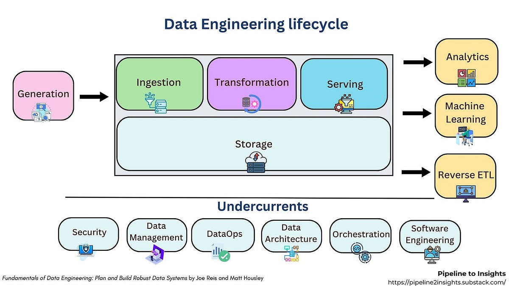

## Short end-to-end example first (so later bits make sense)

Imagine a food-delivery app. Users place orders on the mobile app. Every action (open app, view menu, place order, payment success) is emitted as an **event**.

High level flow:

1. App (data generation) → sends events to Kafka (ingestion).
2. Kafka stores streams; a stream consumer writes raw events to S3 (storage, raw zone).
3. A nightly Spark/dbt job transforms raw events into cleaned tables and aggregates (transformation).
4. Results go to a data warehouse (Snowflake) and a feature store for ML (serving).
5. BI dashboards (Looker) show daily GMV; ML model predicts delivery time; customer support tools get enriched user status via reverse ETL.

Keep this example in mind while I explain the slide components.

---

## 1) Data generation (sources)

**What it is:** where data originates — apps, databases, sensors, logs, third-party APIs.

**Example:** mobile app generates JSON events on every order, backend writes transaction records to Postgres, payment gateway sends webhooks.

**Why it matters:** upstream quality decides how hard downstream processing will be. Garbage in → expensive cleaning later.

**Common failure modes:** missing events, duplicate events, schema changes in source (fields renamed), clock skew.

**Mitigation:** source contracts (API schemas), event IDs and timestamps, local buffering & retry, versioned event schemas.

---

## 2) Ingestion

- it is of two types:
- batch processing
- real time streaming

- ELT(extract load transform) AND ETL(extract transform load) 

**What it is:** reliably moving data from sources into your platform in either batch or streaming fashion.

**Example tools:** Kafka, Google Pub/Sub, Kinesis for streaming; SFTP, scheduled API pulls or Airflow jobs for batch.

**Concrete pattern:** mobile app → Kafka topic `orders.v1`. Consumer persists each message to S3 `s3://company/raw/orders/YYYY/MM/DD/`.

**Key properties you must design for:**

* **Durability:** messages must not be lost.
* **Ordering & delivery semantics:** at-least-once vs at-most-once vs exactly-once.
* **Latency requirements:** real-time metrics vs daily reports.

**Failure modes & fixes:**

* Backpressure in downstream sinks → implement buffering and backoff.
* Consumer crashes → stateless consumers with checkpointing / offsets.

---

## 3) Storage (raw, curated, serving)

**What it is:** where data lives at each maturity stage.

**Zones:**

* **Raw (ingest) zone:** immutable, append-only copies of original events (S3/GCS).
* **Processed/curated zone:** cleaned, deduplicated tables (parquet/columnar).
* **Serving/warehouse:** optimized tables for analysts and BI (Snowflake/BigQuery).

**Example:** store raw JSON events in S3; nightly job writes partitioned Parquet; dbt builds `orders_clean` table in Snowflake.

**Tradeoffs:**

* Data lake (cheap, flexible) vs warehouse (fast, query-optimized) — often you use both.
* Schema-on-read (flexible) vs schema-on-write (safer for consumers).

**Failure modes:** corrupted files, partial writes — use file checksums, atomic writes, and immutability.

---

## 4) Transformation

**What it is:** convert raw data into analytics/ML-ready tables: cleaning, type conversions, joins, aggregations, feature engineering.

**Tools:** Spark, dbt, SQL, Python jobs.

**Concrete SQL example:** (dbt model)

```sql
with raw as (
  select
    event_id,
    user_id,
    event_type,
    payload::json->>'amount' as amount,
    to_timestamp(payload::json->>'ts') as event_ts
  from {{ source('s3','orders_raw') }}
)
select
  order_id,
  user_id,
  cast(amount as numeric) as amount,
  date_trunc('day', event_ts) as order_date
from raw
where event_type = 'order_placed'
```

**Risks:** joining huge tables without keys; long running jobs failing mid-run.
**Mitigation:** partitioning, incremental models, idempotent transforms, tests (dbt tests).

---

## 5) Serving (making data usable)

**What it is:** expose transformed data to consumers — dashboards, APIs, ML features, or reverse ETL back into apps.

**Examples:**

* BI: Looker/Metabase dashboards hitting Snowflake.
* ML: features stored in a Feature Store (Feast) for online inference.
* Reverse ETL: write customer churn scores back into Salesforce.

**SLA considerations:** query latency for dashboards vs low-latency reads for online features.

**Failure modes:** stale data exposure, feature skew between training and serving. Mitigate with a single source of truth for features and strong versioning.

---

## 6) Consumers (analytics, ML, operations)

**Who uses it:** analysts, data scientists, ML models, product teams. Each group has different requirements (freshness, completeness, latency).

**Example uses:** daily cohort reports, real-time fraud detection, personalized offers.

---

## The “Undercurrents” — production concerns everyone forgets

These are cross-cutting engineering necessities:

* **Security:** encryption at rest/in transit, IAM roles, PII masking.
* **Data Management / Catalog:** data cataloging (schema, owner, lineage) so analysts find trustworthy tables.
* **DataOps / CI/CD:** automated testing and deployment for pipelines (unit tests for transformations).
* **Data Architecture:** partitioning, retention policies, cost controls.
* **Orchestration:** workflow managers (Airflow, Prefect) to schedule and retry jobs.
* **Software Engineering:** code reviews, modularization, monitoring, observability (metrics/logs/tracing).

**Example minimums to be production-ready:** schema validation on ingest, automated tests on dbt models, SLOs and alerting for job failures.

---

## Smallest set of changes to make a toy pipeline production-ready

If you built “pandas → CSV → email report”, do these 6 things (minimal, highest impact):

1. **Idempotency & deduplication:** add unique event IDs and idempotent writes.
2. **Schema validation at ingest:** reject or quarantine messages that don’t match.
3. **Retries + checkpointing:** use an orchestrator or consumer offsets with retry/backoff.
4. **Monitoring + alerts:** job success/failure, throughput, data volume, lag.
5. **Access controls & encryption:** protect data with role-based access and encryption.
6. **Documentation + data catalog:** add table descriptions and owners.

Do those first — they catch ~80% of operational issues.

---

## Tradeoffs you must accept and choose between

* **Batch vs streaming:** streaming = fresher but more complex. Batch = simpler and cheaper for many analytics use cases.
* **Lake vs warehouse:** lake is cheap + flexible; warehouse is fast + queryable. Use lake as raw, warehouse for serving.
* **Exactly-once semantics:** expensive to guarantee. Often “at-least-once + idempotency” is the pragmatic choice.

---

## Key failure modes and mitigation (by stage)

* **Source schema drift:** mitigation — contract/versioned schemas, schema checks.
* **Duplicate messages:** mitigation — dedupe on event_id + watermarking.
* **Late arriving data:** mitigation — event time processing, backfill windows.
* **Partial job failure:** mitigation — atomic writes, job retries, checkpoints.
* **Feature skew (train vs serve):** mitigation — shared feature store, tests comparing train/serve distributions.
* **Cost blowup (storage/compute):** mitigation — lifecycle policies, partitioning, sample data preview.

---

## Edge cases & what to watch for

* GDPR/CCPA needs: users can request deletion — implement delete propagation or pseudonymization.
* Small data regimes: heavyweight systems (Kafka+Spark) may be overkill — simpler ETL scheduled jobs can be better.
* Analytic correctness vs speed: some reports can be eventually consistent; some SLAs require strict consistency.

---
